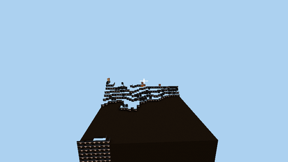
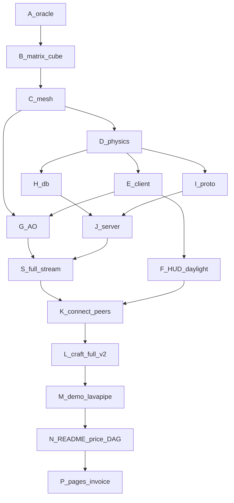

# Craft (Rust rewrite)

Minecraft-style voxel game whose **playable product is rewritten in Rust** — `winit` + `wgpu` (WGSL) client, Tokio TCP server, SQLite persistence, line-oriented multiplayer protocol. This is **not an all-Rust repository**: the original C client (`src/`), Python server (`server.py`), GLSL shaders, and vendored C libraries (`deps/`) are kept in-tree for reference and as the **golden-parity oracle** (see [Repo composition](#repo-composition) and [Original C Craft](#original-c-craft)).

Fork: [zozo123/Craft](https://github.com/zozo123/Craft) · Upstream: [fogleman/Craft](https://github.com/fogleman/Craft)

**Pages (invoice + demo + factory lessons):** [zozo123.github.io/Craft](https://zozo123.github.io/Craft/) · **YC / Show HN post:** [`docs/YC_POST.md`](docs/YC_POST.md)

**Price tag: $112.95 / $120 spent** · ~3.20M tokens · [$7.05 reserve](#price-tag) · [execution DAG](#execution-dag-cleared)

Floor: [islo.dev](https://islo.dev) · build ecosystem: [Incredibuild](https://www.incredibuild.com) · fork: [zozo123/Craft](https://github.com/zozo123/Craft)



*Headless e2e demo (software Vulkan / lavapipe): live server + bot peer builds a tower while an orbit camera records the world. Full quality: [`docs/demo.mp4`](docs/demo.mp4). Details: [`docs/DEMO.md`](docs/DEMO.md).*

## Features (Rust product)

* Deterministic terrain (simplex / perlin noise) bit-checked against the C oracle
* Chunk meshing with ambient occlusion, plants, transparency
* Walkable client: WASD, jump, mouse look, day/night, HUD crosshair, hotbar 1–9
* Multiplayer: Tokio server, full chunk stream, block place/break, peer markers
* SQLite world persistence (`craft-db`)
* Headless `--demo` recorder (PNG frames → mp4/gif) for CI and sandboxes
* CI gate `rust-e2e`: fmt, clippy `-D warnings`, C-golden parity tests, net e2e, demo artifact

## Quick start

Requires a recent Rust toolchain (`rustup` stable).

```bash
git clone https://github.com/zozo123/Craft.git
cd Craft/rust

# Terminal A — server
cargo run -p craft-server -- 0.0.0.0:4080

# Terminal B — interactive client (GPU / display required)
cargo run -p craft-client -- --connect 127.0.0.1:4080
```

### Headless / CI modes

```bash
# Mesh + GPU adapter smoke (safe without a window)
cargo run -p craft-client -- --smoke

# Network handshake + full chunk (needs a running server)
cargo run -p craft-client -- --net-smoke 127.0.0.1:4080
cargo run -p craft-client -- --net-play 127.0.0.1:4080

# Offscreen networked video (needs Vulkan / Metal / DX12; lavapipe on Linux CI)
cargo run -p craft-client -- --demo 127.0.0.1:4080 --frames 150 --out frames --size 960x540
```

Textures are loaded from `textures/texture.png` (repo root) relative to the process cwd — run from `rust/` or set paths accordingly.

## Repo composition

GitHub's language bar shows roughly **Rust ~45% · C ~43% · Python ~10% · GLSL/WGSL/CMake/Make** — because the original project is deliberately retained. Honest breakdown:

| Path | Language | Why it's here |
|---|---|---|
| `rust/` | Rust (+ WGSL) | **The shipped product** — client, server, core, protocol, db, sim |
| `src/` | C | Upstream Fogleman client (reference; not built by the Rust product) |
| `oracle/` | C | Our C dumpers that generate **golden fixtures** for bit-parity tests |
| `deps/` | C | Vendored third-party libs (GLEW, GLFW, lodepng, sqlite, noise, tinycthread) |
| `server.py`, `*.py` | Python | Original upstream server / helpers |
| `shaders/` | GLSL | Original C-client shaders (Rust client uses WGSL in `rust/**/shaders`) |

So: the **game** is Rust; the **C/Python is upstream + the parity oracle**, not the product. `deps/**` is marked `linguist-vendored` in `.gitattributes`.

## Workspace layout (Rust product)

| Crate | Role |
|---|---|
| `craft-core` | Config, items, noise, world, map, mesh + AO, physics, matrix, cube |
| `craft-protocol` | Line-oriented packet encode / parse |
| `craft-db` | SQLite block persistence |
| `craft-server` | Tokio TCP multiplayer server |
| `craft-client` | wgpu client, `OnlineWorld`, `--demo` recorder |
| `craft-sim` | Headless mesh / AO stats |

## Controls (Rust client)

| Input | Action |
|---|---|
| WASD | Move |
| Space / Shift | Jump / descend (flying) |
| Mouse | Look |
| Left / Right click | Break / place |
| 1–9 | Hotbar item |
| Esc | Quit |

## Architecture (e2e)

```
craft-server (Tokio) ── craft-protocol ──▶ craft-client / --demo / --net-play
      ▲ persist (craft-db / SQLite)              │
      │                                         ▼
  peers / bots ── Block + Position ──▶ OnlineWorld ── mesh_map + AO (craft-core)
                                                    ▼
                                          wgpu + WGSL (window or offscreen)
```

## CI & verification

Workflow: [`.github/workflows/rust-core.yml`](.github/workflows/rust-core.yml) (`rust-e2e`)

1. Build C oracle → generate goldens
2. `cargo fmt --check` · `clippy -D warnings` · `cargo test --all` (parity)
3. Client `--smoke` · net e2e (`online_e2e`, `e2e_net`, `--net-smoke`, `--net-play`)
4. Headless demo on lavapipe → upload `craft-rust-demo` artifact (mp4 + gif)

Deterministic `islo` snapshots used during the rewrite: `craft-base-v1` … `craft-full-v2`.

## Price tag

| | |
|---|---|
| **Cap** | **$120.00** |
| **Spent** | **$112.95** (94%) |
| **Remaining** | **$7.05** |
| **Tokens** | ~3.20M (token-primary; `usd_per_1k_tokens = $0.02`) |
| **Gates** | islo / GH Actions deterministic runs = **$0** agent tokens |

Live ledger: [`rust/tools/spend-ledger.json`](rust/tools/spend-ledger.json) · trace: [`rust/COST_TRACE.md`](rust/COST_TRACE.md).

| Wave | $ |
|---|---|
| Planning + DAG + cost model | 8.00 |
| Oracle harness (C goldens) | 1.50 |
| Core port + finish (world/noise/map + parity) | 5.00 |
| Matrix + cube | 3.50 |
| Mesh + craft-sim | 2.50 |
| Physics | 3.00 |
| DAG reopt | 0.50 |
| wgpu walkable client | 9.00 |
| craft-db + protocol | 5.00 |
| craft-server (Tokio) | 5.00 |
| Net e2e | 6.00 |
| Ambient occlusion | 5.00 |
| Online engine + 2-client e2e | 14.00 |
| Product e2e (full stream + HUD + peers) | 16.00 |
| Clippy 1.97 fix | 1.20 |
| Demo recorder + lavapipe CI | 16.00 |
| PR#1 open / verify / merge | 1.50 |
| Rust-first README finish | 3.00 |
| README price tag + DAG | 1.50 |
| GitHub Pages invoice + explanations | 2.50 |
| SW factory lessons (islo + Incredibuild) | 1.50 |
| islo snapshots + GH gates | 0.00 |
| YC / Show HN post + repo-composition honesty pass | 1.70 |
| **Total** | **112.95** |

## Execution DAG (cleared)

How the rewrite was sequenced and gated — every node below is green.



| Node | What cleared it |
|---|---|
| A oracle | C dumpers → goldens → Rust parity |
| B–D | matrix / cube / mesh / physics + e2e tests |
| E client | walkable wgpu + `--smoke` |
| H–J | db + protocol + Tokio server |
| G AO | neighborhood occlusion + `ao_sum` |
| S full stream | chunk >2000 blocks, no sample cap |
| F / K | HUD, daylight, hotbar, peer markers, `--connect` |
| L | islo mp-e2e → snapshot `craft-full-v2` |
| M | headless `--demo` on lavapipe → `docs/demo.{mp4,gif}` |
| N | Rust-first README + price tag + DAG on `master` |
| P | GitHub Pages invoice · budget · sandboxes · credits |

Full board: [`rust/EXECUTION.md`](rust/EXECUTION.md).

---

## Original C Craft

The sections below are the upstream [fogleman/Craft](https://github.com/fogleman/Craft) README, kept for the C client / Python server and historical implementation notes.

Minecraft clone for Windows, Mac OS X and Linux. Just a few thousand lines of C using modern OpenGL (shaders). Online multiplayer support is included using a Python-based server.

http://www.michaelfogleman.com/craft/


### Features

* Simple but nice looking terrain generation using perlin / simplex noise.
* More than 10 types of blocks and more can be added easily.
* Supports plants (grass, flowers, trees, etc.) and transparency (glass).
* Simple clouds in the sky (they don't move).
* Day / night cycles and a textured sky dome.
* World changes persisted in a sqlite3 database.
* Multiplayer support!

### Download

Mac and Windows binaries are available on the website.

http://www.michaelfogleman.com/craft/

See below to run from source.

### Install Dependencies

#### Mac OS X

Download and install [CMake](http://www.cmake.org/cmake/resources/software.html)
if you don't already have it. You may use [Homebrew](http://brew.sh) to simplify
the installation:

    brew install cmake

#### Linux (Ubuntu)

    sudo apt-get install cmake libglew-dev xorg-dev libcurl4-openssl-dev
    sudo apt-get build-dep glfw

#### Windows

Download and install [CMake](http://www.cmake.org/cmake/resources/software.html)
and [MinGW](http://www.mingw.org/). Add `C:\MinGW\bin` to your `PATH`.

Download and install [cURL](http://curl.haxx.se/download.html) so that
CURL/lib and CURL/include are in your Program Files directory.

Use the following commands in place of the ones described in the next section.

    cmake -G "MinGW Makefiles"
    mingw32-make

### Compile and Run

Once you have the dependencies (see above), run the following commands in your
terminal.

    git clone https://github.com/fogleman/Craft.git
    cd Craft
    cmake .
    make
    ./craft

### Multiplayer

After many years, craft.michaelfogleman.com has been taken down. See the [Server](#server) section for info on self-hosting.

#### Client

You can connect to a server with command line arguments...

```bash
./craft [HOST [PORT]]
```

Or, with the "/online" command in the game itself.

    /online [HOST [PORT]]

#### Server

You can run your own server or connect to mine. The server is written in Python
but requires a compiled DLL so it can perform the terrain generation just like
the client.

```bash
gcc -std=c99 -O3 -fPIC -shared -o world -I src -I deps/noise deps/noise/noise.c src/world.c
python server.py [HOST [PORT]]
```

### Controls

- WASD to move forward, left, backward, right.
- Space to jump.
- Left Click to destroy a block.
- Right Click or Cmd + Left Click to create a block.
- Ctrl + Right Click to toggle a block as a light source.
- 1-9 to select the block type to create.
- E to cycle through the block types.
- Tab to toggle between walking and flying.
- ZXCVBN to move in exact directions along the XYZ axes.
- Left shift to zoom.
- F to show the scene in orthographic mode.
- O to observe players in the main view.
- P to observe players in the picture-in-picture view.
- T to type text into chat.
- Forward slash (/) to enter a command.
- Backquote (`) to write text on any block (signs).
- Arrow keys emulate mouse movement.
- Enter emulates mouse click.

### Chat Commands

    /goto [NAME]

Teleport to another user.
If NAME is unspecified, a random user is chosen.

    /list

Display a list of connected users.

    /login NAME

Switch to another registered username.
The login server will be re-contacted. The username is case-sensitive.

    /logout

Unauthenticate and become a guest user.
Automatic logins will not occur again until the /login command is re-issued.

    /offline [FILE]

Switch to offline mode.
FILE specifies the save file to use and defaults to "craft".

    /online HOST [PORT]

Connect to the specified server.

    /pq P Q

Teleport to the specified chunk.

    /spawn

Teleport back to the spawn point.

### Screenshot


### Implementation Details

#### Terrain Generation

The terrain is generated using Simplex noise - a deterministic noise function seeded based on position. So the world will always be generated the same way in a given location.

The world is split up into 32x32 block chunks in the XZ plane (Y is up). This allows the world to be “infinite” (floating point precision is currently a problem at large X or Z values) and also makes it easier to manage the data. Only visible chunks need to be queried from the database.

#### Rendering

Only exposed faces are rendered. This is an important optimization as the vast majority of blocks are either completely hidden or are only exposing one or two faces. Each chunk records a one-block width overlap for each neighboring chunk so it knows which blocks along its perimeter are exposed.

Only visible chunks are rendered. A naive frustum-culling approach is used to test if a chunk is in the camera’s view. If it is not, it is not rendered. This results in a pretty decent performance improvement as well.

Chunk buffers are completely regenerated when a block is changed in that chunk, instead of trying to update the VBO.

Text is rendered using a bitmap atlas. Each character is rendered onto two triangles forming a 2D rectangle.

“Modern” OpenGL is used - no deprecated, fixed-function pipeline functions are used. Vertex buffer objects are used for position, normal and texture coordinates. Vertex and fragment shaders are used for rendering. Matrix manipulation functions are in matrix.c for translation, rotation, perspective, orthographic, etc. matrices. The 3D models are made up of very simple primitives - mostly cubes and rectangles. These models are generated in code in cube.c.

Transparency in glass blocks and plants (plants don’t take up the full rectangular shape of their triangle primitives) is implemented by discarding magenta-colored pixels in the fragment shader.

#### Database

User changes to the world are stored in a sqlite database. Only the delta is stored, so the default world is generated and then the user changes are applied on top when loading.

The main database table is named “block” and has columns p, q, x, y, z, w. (p, q) identifies the chunk, (x, y, z) identifies the block position and (w) identifies the block type. 0 represents an empty block (air).

In game, the chunks store their blocks in a hash map. An (x, y, z) key maps to a (w) value.

The y-position of blocks are limited to 0 <= y < 256. The upper limit is mainly an artificial limitation to prevent users from building unnecessarily tall structures. Users are not allowed to destroy blocks at y = 0 to avoid falling underneath the world.

#### Multiplayer

Multiplayer mode is implemented using plain-old sockets. A simple, ASCII, line-based protocol is used. Each line is made up of a command code and zero or more comma-separated arguments. The client requests chunks from the server with a simple command: C,p,q,key. “C” means “Chunk” and (p, q) identifies the chunk. The key is used for caching - the server will only send block updates that have been performed since the client last asked for that chunk. Block updates (in realtime or as part of a chunk request) are sent to the client in the format: B,p,q,x,y,z,w. After sending all of the blocks for a requested chunk, the server will send an updated cache key in the format: K,p,q,key. The client will store this key and use it the next time it needs to ask for that chunk. Player positions are sent in the format: P,pid,x,y,z,rx,ry. The pid is the player ID and the rx and ry values indicate the player’s rotation in two different axes. The client interpolates player positions from the past two position updates for smoother animation. The client sends its position to the server at most every 0.1 seconds (less if not moving).

Client-side caching to the sqlite database can be performance intensive when connecting to a server for the first time. For this reason, sqlite writes are performed on a background thread. All writes occur in a transaction for performance. The transaction is committed every 5 seconds as opposed to some logical amount of work completed. A ring / circular buffer is used as a queue for what data is to be written to the database.

In multiplayer mode, players can observe one another in the main view or in a picture-in-picture view. Implementation of the PnP was surprisingly simple - just change the viewport and render the scene again from the other player’s point of view.

#### Collision Testing

Hit testing (what block the user is pointing at) is implemented by scanning a ray from the player’s position outward, following their sight vector. This is not a precise method, so the step rate can be made smaller to be more accurate.

Collision testing simply adjusts the player’s position to remain a certain distance away from any adjacent blocks that are obstacles. (Clouds and plants are not marked as obstacles, so you pass right through them.)

#### Sky Dome

A textured sky dome is used for the sky. The X-coordinate of the texture represents time of day. The Y-values map from the bottom of the sky sphere to the top of the sky sphere. The player is always in the center of the sphere. The fragment shaders for the blocks also sample the sky texture to determine the appropriate fog color to blend with based on the block’s position relative to the backing sky.

#### Ambient Occlusion

Ambient occlusion is implemented as described on this page:

http://0fps.wordpress.com/2013/07/03/ambient-occlusion-for-minecraft-like-worlds/

#### Dependencies

* GLEW is used for managing OpenGL extensions across platforms.
* GLFW is used for cross-platform window management.
* CURL is used for HTTPS / SSL POST for the authentication process.
* lodepng is used for loading PNG textures.
* sqlite3 is used for saving the blocks added / removed by the user.
* tinycthread is used for cross-platform threading.
