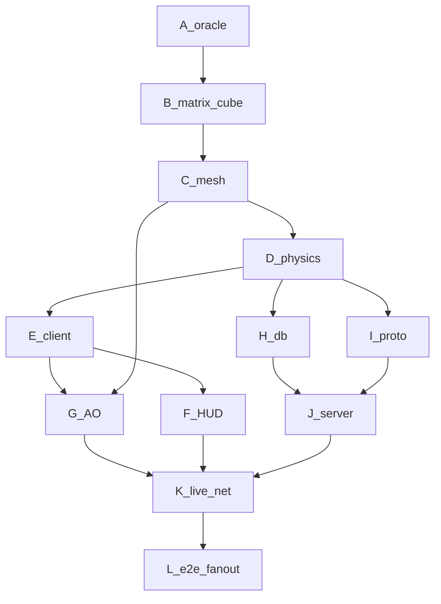

# Live cost trace — Craft Rust finish ($120, token-primary)

**Cap: $120.00** · tokens → USD via `usd_per_1k_tokens` · islo gates = **0 tokens**

```
spent $49.05 / $120.00   remain $70.95   (prior $80 work retained)
```

## Correct DAG



| Wave | Status | Gate / sandbox |
|---|---|---|
| A–E, H∥I, J, K-smoke | DONE | `craft-full-v0` |
| **G AO** | **NOW** | `craft-mesh-fanout` + parallel `islo use` |
| F HUD | next | craft-gate |
| K+ live net | next | multi-client sandboxes |
| L full e2e | last | GH + `craft-full-v1` |

```bash
python3 rust/tools/cost_report.py
python3 rust/tools/append_spend.py --job WAVE --kind cursor_write --tokens N --notes "..."
```
