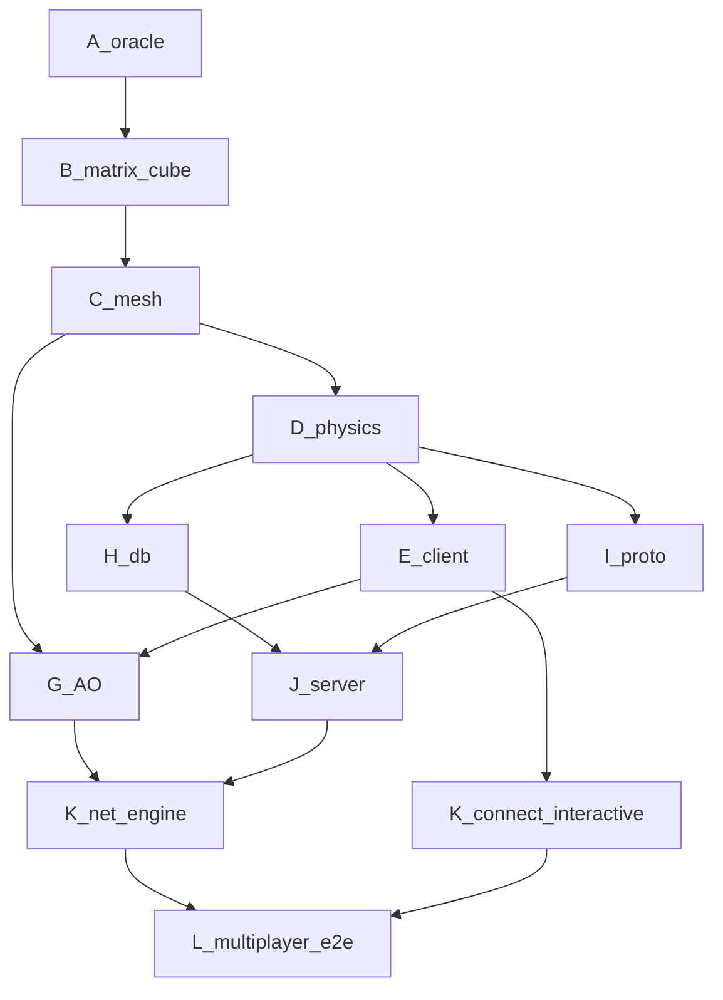

# Live cost trace — Craft Rust product e2e ($120, token-primary)

**Cap: $120.00** · tokens → USD via `usd_per_1k_tokens` · islo/CI gates = **0 tokens**

```
spent $68.05 / $120.00   remain $51.95   (57% used)   tokens≈950k
```

## DAG (all critical nodes DONE)



| Wave | Item | Δ$ | Cumul | Gate (all green) |
|---|---|---:|---:|---|
| A–E,H,I,J | core→client→db→proto→server | 43.05 | 43.05 | GH + `craft-full-v0` |
| K bring-up | net-smoke | 6.00 | 49.05 | GH |
| **G** | AO occlusion + `ao_sum` | 5.00 | 54.05 | `craft-ao-v1` bake |
| **K** | OnlineWorld + 2-client e2e + `--net-play` | 14.00 | 68.05 | `craft-mp-e2e` + GH net-play |
| islo | 6 parallel gates | 0.00 | 68.05 | mesh-fanout, mp-e2e, 3 sandboxes |
| reserve | | ≤51.95 | ≤120 | |

## Signals collected in parallel (this sprint)

| Signal | Where | Result |
|---|---|---|
| AO grid (9 chunks) | `craft-mesh-fanout` job | ✓ baked `craft-ao-v1` |
| 2-client + 2 live net-play | `craft-mp-e2e` job | ✓ fresh VM |
| fmt+clippy+parity+all tests | `craft-regress` sandbox | ✓ |
| release net-play | `craft-release` sandbox | ✓ |
| AO neg/pos chunk stats | `craft-ao-neg/pos` sandbox | ✓ ao_sum 2435/5711 |
| full CI incl. live net-play | GitHub Actions | ✓ green |

## Bugs found & fixed via signals

- **Stale sim binary** in fanout job (`--tests` didn't build the bin) → build bin explicitly.
- **`rg` missing** in runner sandboxes → use grep/python.
- **`P,id,...` mis-parsed** as 5-field Position → added `PlayerPosition`/`PlayerLeave`.
- **Hung stress sandbox** (`wait` blocked on never-exiting server) → script bug, not code.

```bash
python3 rust/tools/cost_report.py
cargo run -p craft-server -- 0.0.0.0:4080         # host
cargo run -p craft-client -- --connect HOST:4080  # interactive networked play
cargo run -p craft-client -- --net-play HOST:4080 # headless product e2e
```
