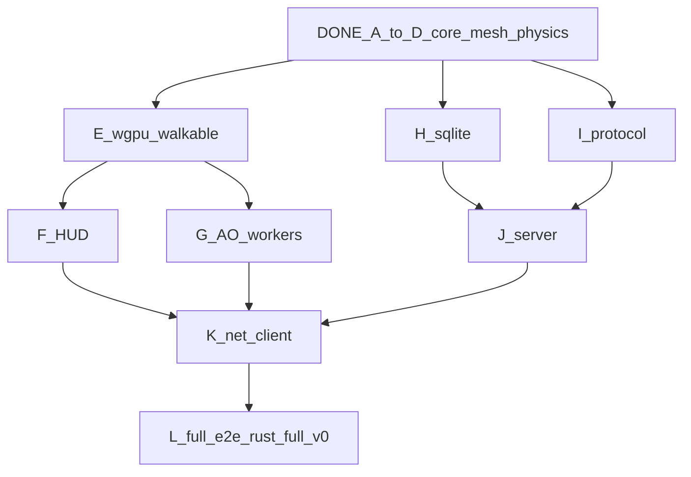

# Live cost trace — Craft Rust finish line

**Cap: $80.00** · **Hard stop at cap** · Model: Cursor writes · islo/GH gates only

| When | Wave | Item | Δ $ | Cumul $ | Remain $ | Gate |
|---|---|---|---:|---:|---:|---|
| start | — | prior (plan→physics D) | 23.55 | 23.55 | 56.45 | green |
| *reopt* | — | graph rewrite (this doc) | 0.50 | 24.05 | 55.95 | — |
| … | E | wgpu client MVP | ≤10 | ≤34 | ≥46 | pending |
| … | F | HUD / day cycle | ≤5 | ≤39 | ≥41 | pending |
| … | G | AO+workers (lite) | ≤6 | ≤45 | ≥35 | pending |
| … | H∥I | db + protocol | ≤8 | ≤53 | ≥27 | pending |
| … | J | Tokio server | ≤6 | ≤59 | ≥21 | pending |
| … | K+L | net + full e2e | ≤8 | ≤67 | ≥13 | pending |
| … | reserve | retries | ≤13 | ≤80 | ≥0 | — |

Update this table and `tools/spend-ledger.json` after every wave via:

```bash
python3 rust/tools/append_spend.py --job WAVE --kind cursor_write --usd N --notes "..."
python3 rust/tools/cost_report.py
```

## Reoptimized critical path (why)

Old plan was serial J5→…→J16. New plan **cuts the critical path** and **fans out pure crates**:



**Rules**
1. Ship **walkable client** before perfect AO (flat mesh already works).
2. **H ∥ I** on islo (different crates, fork `craft-sim-v1`).
3. Never nest agents in job VMs.
4. Every wave: local test → push GH → optional islo snapshot bake → `append_spend`.
5. If remain < next wave estimate → shrink scope, don't blow cap.

## islo fork chain

`craft-base-v1` → `craft-mesh-v1` → `craft-sim-v1` → *(next)* `craft-client-v1` / `craft-db-v1` / `craft-proto-v1`
