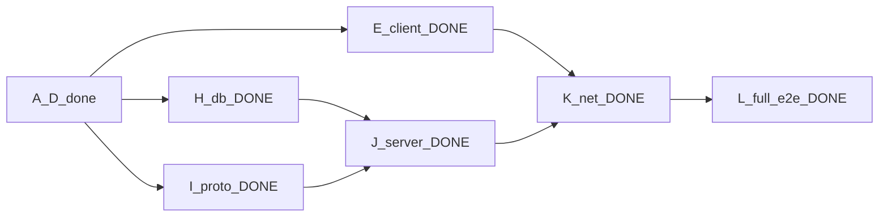

# Live cost trace — Craft Rust finish line

**Cap: $80.00** · **Hard stop at cap** · Cursor writes · islo/GH gates

```
spent $49.05 / $80.00   remain $30.95   (61% used)
```

| When | Wave | Item | Δ $ | Cumul $ | Remain $ | Gate |
|---|---|---|---:|---:|---:|---|
| prior | A–D | plan→physics | 23.55 | 23.55 | 56.45 | green |
| reopt | — | DAG + COST_TRACE | 0.50 | 24.05 | 55.95 | docs |
| | E | wgpu `craft-client` walkable + `--smoke` | 9.00 | 33.05 | 46.95 | Metal smoke OK |
| | H∥I | `craft-db` + `craft-protocol` | 5.00 | 38.05 | 41.95 | unit tests |
| **now** | **J** | Tokio `craft-server` + lib | 5.00 | 43.05 | 36.95 | e2e_net |
| **now** | **K+L** | `--net-smoke` + CI net e2e (`rust-full-v0`) | 6.00 | **49.05** | **30.95** | local net OK |
| deferred | F | HUD / daylight | — | | | polish later |
| deferred | G | AO+workers | — | | | polish later |
| reserve | | | ≤30.95 | ≤80 | | |

```bash
python3 rust/tools/cost_report.py
python3 rust/tools/append_spend.py --job WAVE --kind cursor_write --usd N --notes "..."
```

## Reoptimized graph (finish line)

Skipped F/G polish to hit multiplayer e2e under budget.



## How to run

```bash
cd rust
cargo run -p craft-client                  # local walkable
cargo run -p craft-client -- --smoke       # CI GPU/mesh smoke
CRAFT_DB=/tmp/c.db cargo run -p craft-server -- 127.0.0.1:4080
cargo run -p craft-client -- --net-smoke 127.0.0.1:4080
cargo test -p craft-server --test e2e_net
```
