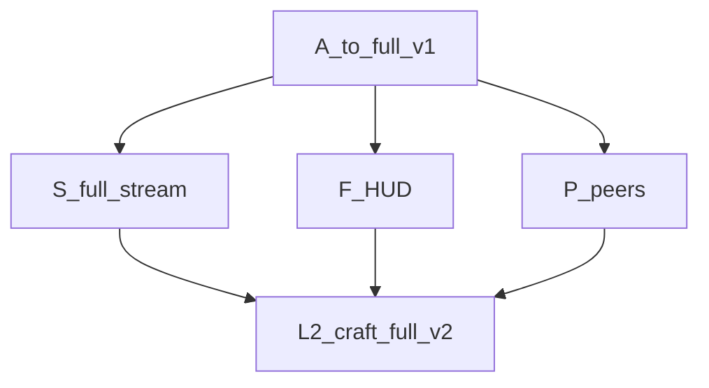

# Live cost trace — take it to the end ($120)

```
spent $68.05 → +stream/HUD/peers (pending append) / $120
```

## End DAG



| Package | Status |
|---|---|
| Full chunk stream + DB overlay | DONE (local e2e green) |
| HUD crosshair + daylight + hotbar | DONE |
| Peer markers | DONE |
| islo/GH `craft-full-v2` | IN FLIGHT |

```bash
python3 rust/tools/cost_report.py
```
