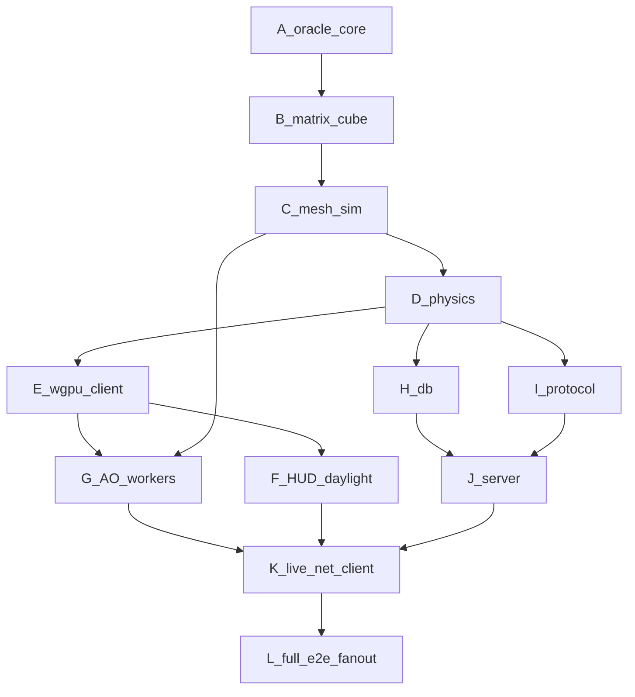

# Craft → Rust — Correct finish DAG ($120, token-primary)

See [COST_TRACE.md](COST_TRACE.md). Cap raised to **$120**. Cost accounting is **token-primary** (USD derived); islo gates are **$0 agent tokens**.

## Correct DAG (factory)



### Why this order (corrected)

| Edge | Reason |
|---|---|
| G after E+C | AO needs mesh path + client shader already consuming ao/light |
| F after E | HUD/daylight are client-only; parallelizable with G |
| K after F+G+J | Live net needs remesh-with-AO + HUD + server |
| L last | Multi-sandbox / CI fanout proves the factory, not just a unit |

### Cleared already

A–E, H∥I, J, bring-up K/L (`rust-full-v0` net-smoke).

### Remaining (this sprint)

| Wave | Gate | Sandboxes |
|---|---|---|
| **G** | AO mesh stats + ao_sum≠0 | mesh-fanout job ∥ `islo use --snapshot` |
| **F** | client smoke + daylight uniform | craft-gate |
| **K+** | live `--connect` remesh/build | multi-client sandboxes |
| **L** | GH + islo `craft-full-v1` | fanout grid + 2-client net |

## Run loop (every wave)

```bash
cd rust && cargo fmt && cargo clippy --all-targets -- -D warnings && cargo test --all
# sandbox signal (deterministic, $0 tokens)
islo use --snapshot craft-full-v0 craft-g-ao -- bash -lc '...'
# or job
islo job deploy --path jobs/craft-mesh-fanout/job.toml && islo job run craft-mesh-fanout --watch
git push origin rust-rewrite
python3 rust/tools/append_spend.py --job WAVE --kind cursor_write --tokens N --notes "..."
python3 rust/tools/cost_report.py
```
