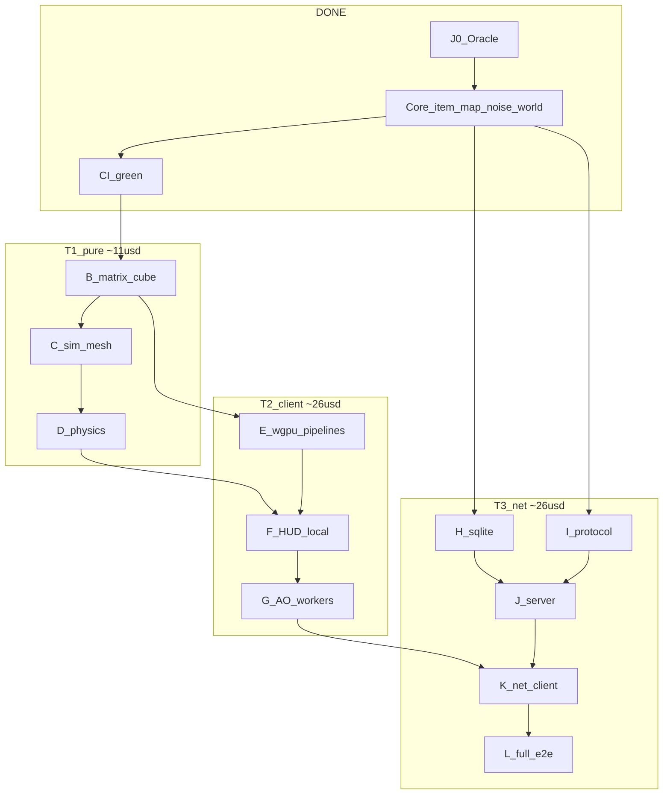
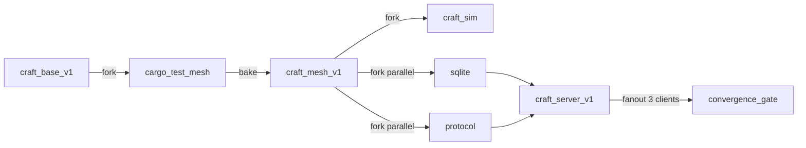

# Craft → Rust — Finish-line execution graph ($80 cap)

```
spent ~$14.55 / cap $80.00   remaining ≈ $65.45
target: rust-full-v0 (full C/Python parity)
model: Cursor writes code; islo forkable microVMs + GitHub Actions run gates
```

Nested agents still **cannot** auth inside job sandboxes. islo value = **snapshot forks**,
deterministic gates, parallel crate-isolated VMs, rollback on fail.

---

## Optimal critical path (waves)



| Wave | Ships | Est. $ | Cumul | islo use |
|---|---|---:|---:|---|
| A done | oracle + core + CI | 14.55 | 14.55 | `craft-base-v1` |
| **B** | matrix + cube parity | 3.50 | 18 | fork base → gate → `craft-mesh-v1` |
| **C** | craft-sim mesh stats | 3.00 | 21 | fork mesh |
| **D** | physics headless | 4.00 | 25 | fork mesh |
| **E** | wgpu block/sky/line/text | 12.00 | 37 | fork; GPU may be limited — GH + local |
| **F** | HUD / local client | 6.00 | 43 | smoke gate |
| **G** | AO + chunk workers | 8.00 | 51 | fork |
| **H** | SQLite + signs | 5.00 | 56 | fork `∥ I` |
| **I** | protocol 14 packets | 5.00 | 61 | fork `∥ H` |
| **J** | Tokio server | 8.00 | 69 | fork after H+I |
| **K+L** | net client + full e2e | 8.00 | 77 | multi-sandbox fanout |
| reserve | retries | ≤3 | ≤80 | — |

**Parallel safe:** H ∥ I (different crates). Everything else serial on critical path.

---

## How islo runs the graph



Per wave:
1. Cursor lands code on `rust-rewrite`
2. `islo job run` with `snapshot_name` = last green snap
3. Job: `git pull` → `cargo test` / binary gate (no agent)
4. On green: `snapshot` next name
5. On fail: discard VM, fix, retry ≤2
6. `append_spend.py` after each wave

GitHub Actions remains the public e2e oracle for pure crates (same-runner goldens).

---

## Finish definition (`rust-full-v0`)

1. Local client plays: walk, place/break, chat UI, day/night sky  
2. Server + 3 clients converge on blocks/signs  
3. SQLite roundtrip matches C schema  
4. All golden parity tests green on CI  
5. Spend ledger ≤ $80  
