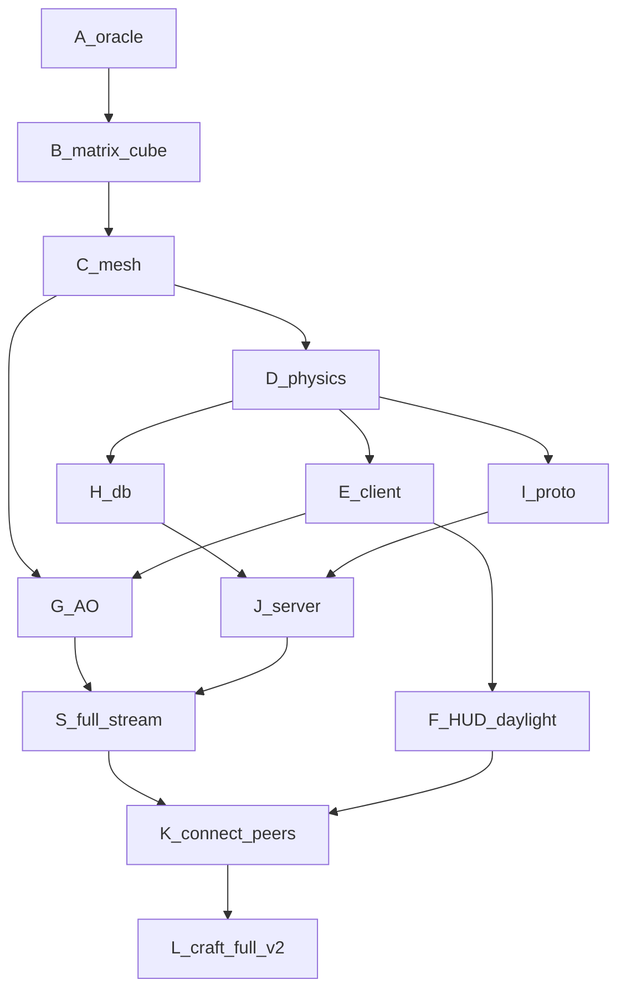

# Craft → Rust — End graph (product e2e v2)

Cap **$120** token-primary. See [COST_TRACE.md](COST_TRACE.md).



## Cleared

| Node | Gate |
|---|---|
| A–L1 | `craft-full-v1` |
| S full chunk stream | e2e_net / online_e2e / `--net-play` |
| F HUD + daylight + hotbar 1–9 | interactive `--connect` |
| P peer markers | drawn in `--connect` |
| L2 | GH + islo → **`craft-full-v2`** |
| Demo + CI | `--demo` + lavapipe artifact + PR#1 merged |
| README finish | Rust-first README + docs demo on `master` |

## Run

```bash
cd rust
cargo run -p craft-server -- 0.0.0.0:4080
cargo run -p craft-client -- --connect 127.0.0.1:4080
cargo run -p craft-client -- --net-play 127.0.0.1:4080
islo job deploy --path jobs/craft-mp-e2e/job.toml && islo job run craft-mp-e2e --watch
```
